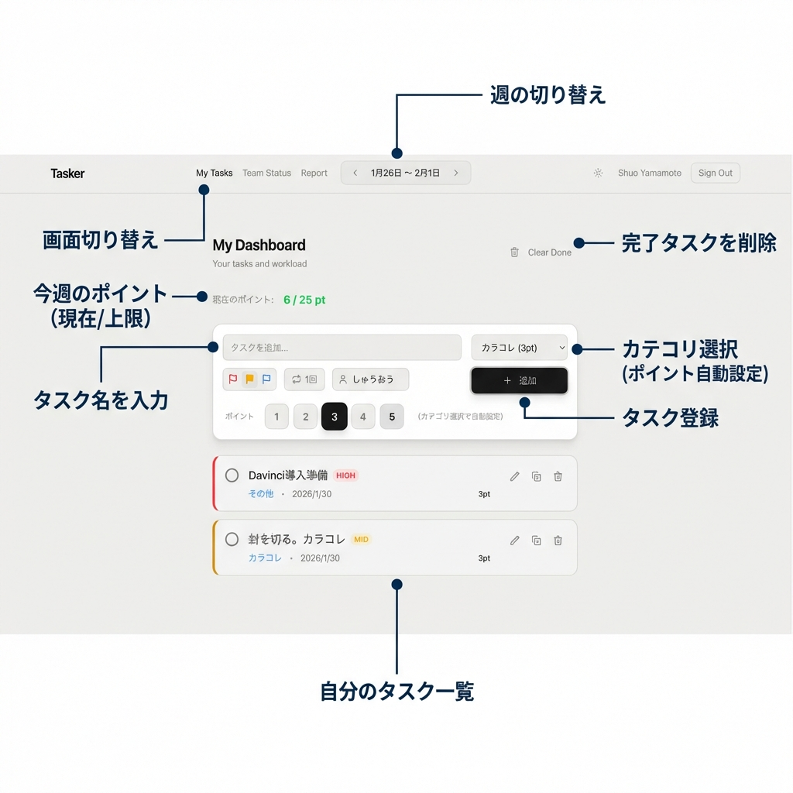
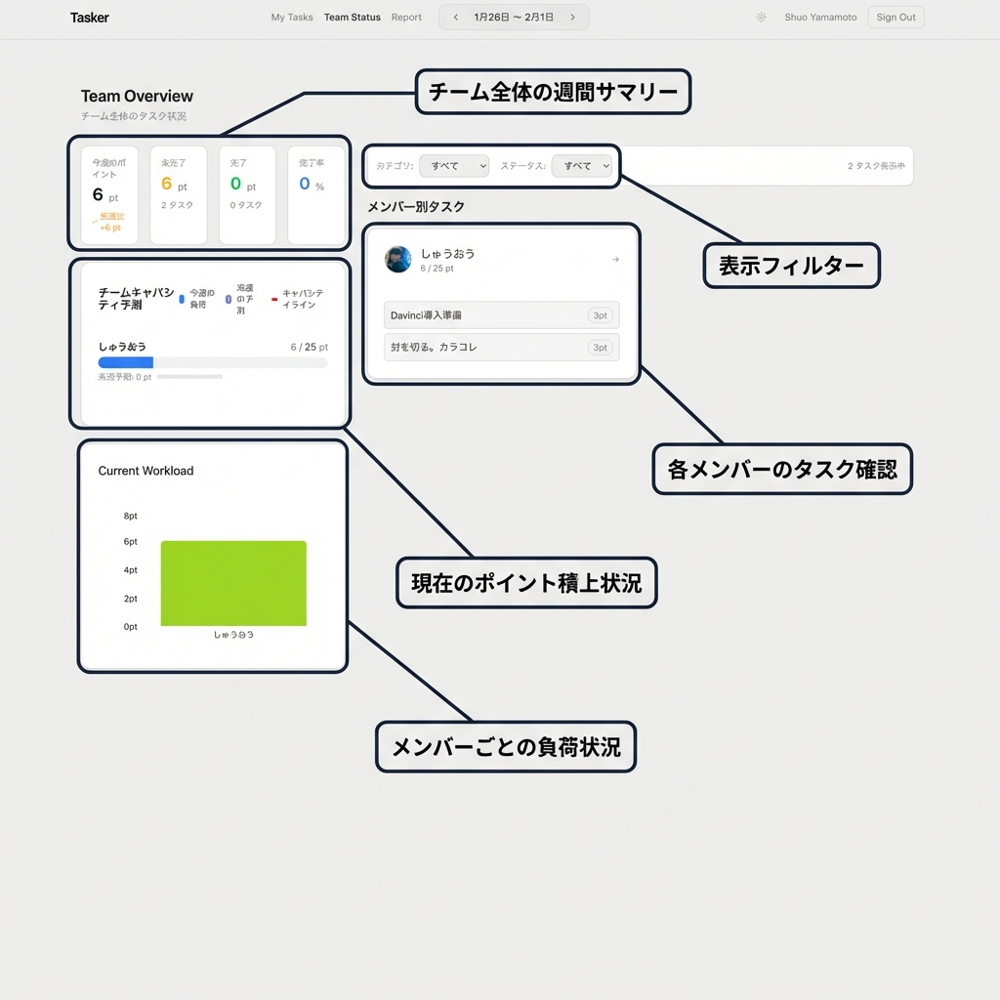
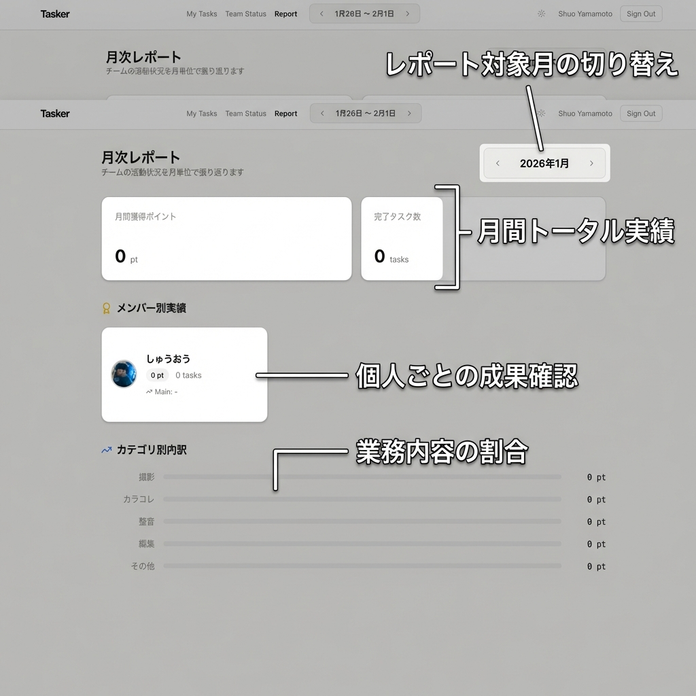

# Tasker 使い方ガイド

## 説明
- このTaskerではタスクにポイントを振って、週間管理します。
- 週あたりのポイント合計値を決めてオーバーしないようにタスク管理しましょう。
- ポイントは以下のように割り振られています。

| カテゴリ | ポイント |
| :--- | :--- |
| 撮影 | 5 pt |
| カラコレ | 3 pt |
| 整音 | 3 pt |
| 編集 | 5 pt |
| その他 | 3 pt |

- ご自身の現在のタスク感から程よい値を設定してください。

---

## 1. マイダッシュボード (My Tasks)
個人のタスク管理を行うメイン画面です。

### 主な機能
- **週の切り替え**: 上部のナビゲーションで表示する週を切り替えます。
- **画面切り替え**: 「My Tasks」「Team Status」「Report」のタブで画面を移動します。
- **今週のポイント**: あなたの現在の積み上げポイントと、設定された上限（キャパシティ）が表示されます。
- **タスク登録**: 
  - タスク名を入力し、カテゴリ（ポイント）を選択して「追加」します。
  - カテゴリを選ぶと自動でポイントが設定されます。
- **タスク一覧**: 登録したタスクが表示されます。完了や削除もここから行います。
- **完了タスク削除**: 「Clear Done」ボタンで完了済みタスクを一括削除して整理できます。

---

## 2. チーム状況 (Team Status)
チーム全体の負荷状況や進捗を確認する画面です。

### 主な機能
- **チーム全体の週間サマリー**: チーム合計の獲得ポイントや完了率などを一目で確認できます。
- **メンバーごとの負荷状況**: 「チームキャパシティ予測」グラフで、誰が忙しいか（キャパシティラインを超えているか）を可視化します。
- **現在のポイント積上状況**: 棒グラフで各メンバーの現在の作業量（ポイント）を比較できます。
- **表示フィルター**: カテゴリやステータスで表示内容を絞り込めます。
- **各メンバーのタスク確認**: メンバーごとのカードで、具体的に誰がどんなタスクを持っているかを確認できます。

---

## 3. 月次レポート (Report)
月単位での振り返りを行うための画面です。

### 主な機能
- **レポート対象月の切り替え**: 過去の月のデータに遡って確認できます。
- **月間トータル実績**: その月にチーム全体で獲得した総ポイントと完了タスク数を表示します。
- **個人ごとの成果確認**: メンバーごとの獲得ポイントと消化タスク数を確認できます。
- **業務内容の割合**: 「カテゴリ別内訳」で、どのような業務（撮影、編集など）にリソースを使ったかを把握できます。
